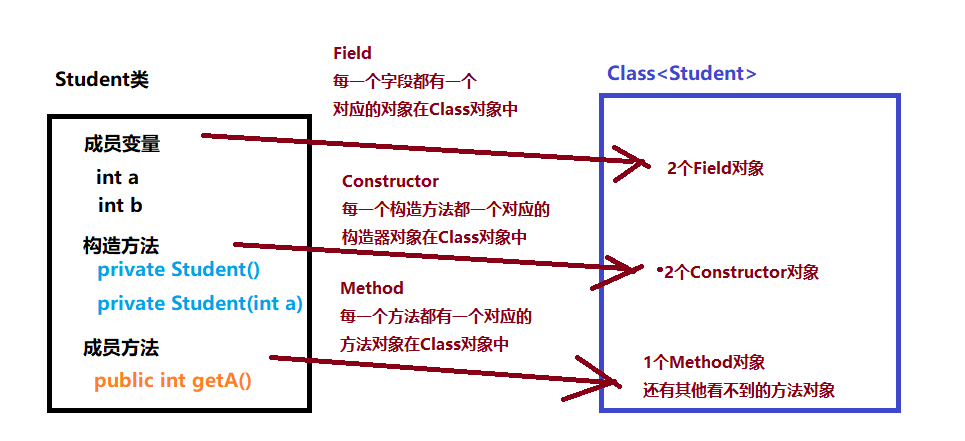

#### 复习

~~~java
1.索引：主要是提高查询性能。
2.索引分类：主键索引 唯一索引 普通索引 组合索引 全文索引 hash索引
3.索引底层数据结构是b+tree.非叶子结点是由：索引+指针域   叶子结点：索引+数据(数据地址)，是双链表
4.jdbc:java dadabase connection 使用java代码连接数据库
5.jdbc编程步骤：
    1）注册驱动 DriverManager.registerDriver(new Driver());
    2）获取连接 Connection conn = DriverManager.getConnection("jdbc:mysql://localhost:3306/数据库名","用户名","密码");
    3）获取发送sql语句对象 PreparedStatement pst = conn.preparedStatement("select * from 表名 where username=?")
        优点：1）防止sql注入  2）效率高
    4）发送sql
        查询：ResultSet rs = pst.executeQuery();
		增删改：int i = pst.executeUpdate(); 影响行记录数
    5)处理结果集
            while(rs.next()){
                rs.getInt(第几列或者字段名或者别名)
            }
    6）释放资源
        
6.数据库连接池：优化连接。初始化连接池的时候先从数据库服务器获取一部分连接放到连接池中，当用户访问的时候直接从连接池中获取，使用完之后再将连接放回到数据库连接池中。
7.德鲁伊数据库连接池
        1）导入jar包
        2）获取连接池对象
         DataSource ds = DruidDataSourceFactory.createDataSource(Properties p);
		3)从连接池中获取连接对象
         Connection conn = ds.getConnection();
~~~


#### 01_类的加载

**目标**

- 能够理解字节码加载过程    【了解】

**路径**

1. 类的加载过程
2. 类的加载时机

---

> 类的加载

- 当程序在运行后，第一次使用某个类的时候，会将此类的class文件读取到内存，并将此类的所有信息存储到一个Class对象中


说明：Class对象是指java.lang.Class类的对象，此类由Java类库提供，专门用于存储类型的信息


> 类的加载机制

在以下情况下会加载类：

1. 创建一个类的对象（第1次）

2. 调用类的静态方法，静态变量 （第1次）

3. 使用一个类的子类时 （第1次）

4. 通过反射进行加载类  

5. java命令执行某一个类  （第1次）运行java程序

   ~~~java
   public class HelloWorld{
       public static void main(String[] args){
           System.out.println("Hello World!");
       }
   }
   
   //编译： javac HelloWorld.java    //生成：HelloWorld.class  字节码文件
   //运行： Java HelloWorld   //使用java命令执行HelloWorld类（默认调用main方法）
                             //底层： HelloWorld.main(null);
   ~~~

   


**小结**

问题1：Student.class文件中都包含什么内容？

- 构造方法、成员变量、成员方法

在jvm执行某个类时，如果该类是第一次被执行：

- 先把该类的.class文件读取到内存中
- 基于.class文件创建一个Class对象（方法区）
  - Class对象中存储的是.class文件中的内容：构造方法、成员变量、成员方法
    - Class对象中存储的构造方法：构造器对象       Constructor对象
    - Class对象中存储的成员变量：字段对象           Field对象
    - Class对象中存储的成员方法：方法对象            Method对象


#### 02_类加载器

**目标**

- 了解类加载器的概念    【了解】

**路径**

1. 类加载器的作用
2. 类加载器的分类
3. 获取类加载器的方式

---

> 类加载器的作用

什么是类加载器？

- 加载器是Java运行时环境的一部分，负责加载字节码文件

类加载器的作用：

- 负责将磁盘上的某个class文件读取到内存并生成Class的对象


> 类加载器的分类：

Java中有三种类加载器，它们分别用于加载不同种类的class：

- 启动类加载器(Bootstrap ClassLoader)：用于加载系统类库<JAVA_HOME>\bin目录下的class，例如：rt.jar。
- 扩展类加载器(Extension ClassLoader)：用于加载扩展类库<JAVA_HOME>\lib\ext目录下的class。
- 应用程序类加载器(Application ClassLoader)：用于加载我们自定义类的加载器。


> 获取类加载器的方式

来自Class类型获取类加载器的方法：

```java
public ClassLoader getClassLoader()  //返回该类的类加载器
//有些实现可能使用null来表示引导类加载器(启动类加载器)
//如果该类由引导类加载器(启动类加载器)加载，则此方法在这类实现中将返回 null 
```

代码实践：

~~~java
//自定义类型
class Student{
    private int age;
}

//测试类
public class Demo01 {
    public static void main(String[] args){
        //获取自定义类的类加载器
        //1. 先获取Student对应的Class对象
        Class<Student> cls = Student.class;  
        
        //2. 再通过该class对象获取类加载器
        ClassLoader loader = cls.getClassLoader();
        
        System.out.println("loader = "+loader);//ClassLoaders$AppClassLoader@2437c6dc

        
        //获取String类的类加载器
        ClassLoader loader2 = String.class.getClassLoader();
        System.out.println("loader2 = " + loader2);
    }
}
~~~


**小结**

类加载器的作用：

- 把硬盘上的.class文件读取到内存中并创建Class对象

类加载器可以分为3种：

- 引导类加载器(启动类加载器)    负载加载系统类库（java.lang包）
- 扩展类加载器        负责加载jdk扩展的类库
- 应用程序类加载器    负责加载程序员自己写的类


#### 03_双亲委派机制

**目标**

- 了解双亲委派机制的工作过程    【了解】

**路径**

1. 3种类加载器的关系
2. 双亲委派机制
3. 双亲委派机制的好处

---

> 3种类加载器的关系

​	

从上图可知，三种类加载器存在一定的关系：

- 应用程序类加载器的父级类加器是扩展类加载器
- 扩展类加载器的父级类加载器是启动类加载器

结论：这种关系称为类加载器的"双亲委派模型"


> 双亲委派机制

"双亲委派模型"的工作机制：

- 某个"类加载器"收到类加载的请求，它首先不会尝试自己去加载这个类，而是把请求交给父级类加载器
- 因此，所有的类加载的请求最终都会传送到顶层的"启动类加载器"中
- 如果"父级类加载器"无法加载这个类，然后子级类加载器再去加载

"双亲委派模型"中，除了顶层的启动类加载器外，其余的类加载器都应当有自己的"父级类加载器"


**小结**

双亲委派机制：

- 在使用一个类时，类并不会由应用程序类加载器来加载，而是由"双亲:启动类加载器、扩展类加载器"先来进行加载，当"双亲"无法加载时，才由应用程序类加载器来完成.class的加载及Class对象的创建


#### 04_反射：概述

**目标**

- 了解反射技术的作用     【了解】

**路径**

1. 反射的概述
2. 反射技术的作用

---

> 反射

反射技术：

- 其实就是对类进行解剖的技术
  - 类中有什么？
    - 构造方法
    - 成员变量
    - 成员方法

结论：反射技术就是把一个类进行了解剖，然后获取到 构造方法、成员变量、成员方法


反射技术的应用案例：

- idea
- 框架技术：Spring


想要使用反射技术有一个必备条件：

- Class对象
  - 原因：.class文件由类加载器读取并创建Class对象。Class对象中存储了.class文件中的内容：构造方法、成员变量、成员方法


> 反射技术的作用

使用反射技术，可以对类进行解剖，可以获取到类中的：构造方法、成员变量、成员方法

- 构造方法： 可以创建对象
- 成员方法： 可以调用执行
- 成员变量： 赋值、取值


反射技术的作用：

- 不用使用new关键字，就可以创建对象
- 不用使用"对象名.方法"形式，就可以调用方法
- 不用使用"对象名.属性"形式，就可以给属性赋值、取值
  - 通常在类中属性，都被修饰为private（私有的：外部不能访问）
  - 反射技术，可以做到对私有成员进行操作


示例：

~~~java
"cn.itcast.pojo.Student" stu = new cn.itcast.pojo.Student();


给一个字符串："cn.icast.pojo.Student"

创建一个对象：?????   //使用new做不到  
           使用反射技术可以实现
~~~

示例：

~~~java
给一个Student.class

程序在运行中，不能停止, 动态的获取一个Student.class
    //使用反射技术，可以在JVM运行状态下，动态的获取并加载Student.class
      
~~~


**小结**

反射技术 ：对类进行解剖的技术

反射技术的作用：可以不通过传统方式，来实现类的实例化、方法的调用

- 实现的提前：需要使用Class对象


#### 05_反射：Class类

**目标**

- 掌握Class对象的获取方式     【掌握】

**路径**

1. Class类
2. 获取Class类对象的方式
3. Class类中的常用方法

---

> Class类

- Class就是用来描述正在运行的java类型
- `Class`类的实例表示Java中任何正在运行的类型，每一个类型都有与之对应的Class对象
  
  - 比如：类，接口，枚举，注解，数组，基本数据类型，void 都有与之对应的Class对象
  
    - ~~~java
      类名.class
      接口名.class
      int.class
      boolean.class
      array.class    
      ~~~


> 获取Class对象

获取Class类对象的方式有3种：

~~~java
方式一：类型名.class   //Student.class
方式二：对象.getClass()  //对象名.getClass()
方式三：Class.forName(String className) //className是全路径类名 = 包名+类型名
~~~


~~~java
//方式1：类型名.class
//应用场景： 当类名明确时，可以直接使用"类名.class"
Class clz = String.class 
Class clz = int.class 
Class clz = double.class
    
//方式2：对象.getClass()
//应用场景：通常是应用方法中
 public void method(Student stu){
    Class clz = stu.getClass();   
 } 

//方式3： Class.forName("类的全名称");//带有包名的类
//应用场景： 通常使用在读取配置文件中的类型
pro.properties文件
--------------文件内容------------------    
className=cn.icast.pojo.Student   
---------------------------------------   
//代码实现    
ResourceBundler r = ResourceBundler.getBundler("pro");
String className = r.getString("className");//"cn.icast.pojo.Student"
    
Class StudentClass = Class.forName(className);//className="cn.icast.pojo.Student" 

//当获取到Class对象了，就可以对类进行解剖了
~~~


> Class类中的常用方法

~~~java
String getSimpleName()  // 获得类名字符串：类名
String getName()   // 获得类全名：包名+类名
T newInstance() // 创建Class对象关联类的对象 (前提：类中有一个无参构造方法)
    
//示例：
      Studentod类    cn.itcast.pojo.Student     //public Student(){}
      
      Class stuClass = Student.class;
      Object obj = stuClass.newInstance();//调用Student()  创建Student对象
      
      Student stu = (Student) obj;
~~~


代码实现：

~~~java
public class Test01 {

    @Test
    public void testMethod3() throws ClassNotFoundException, IllegalAccessException, InstantiationException {
        Class stuClass = Class.forName("com.itheima.cls.demo2.Student");

        Student stu = (Student) stuClass.newInstance();

        stu.study();
    }


    @Test
    public void testMethod2() throws IllegalAccessException, InstantiationException {
        Student stu =new Student();

        //对象名.getClass()
        Class studentClass = stu.getClass();

        Student student = (Student) studentClass.newInstance();

        student.study();
    }


    @Test
    public void testMethod1() throws IllegalAccessException, InstantiationException {
        // 类型名.class
        Class studentClass = Student.class;
        //System.out.println(studentClass);

        System.out.println("带有包名的类："+studentClass.getName());
        System.out.println("类名："+studentClass.getSimpleName());

        //实例化Student对象
        Object obj = studentClass.newInstance();
        Student stu = (Student) obj;
        stu.age=20;
        stu.name="张三";
        System.out.println(stu.name+"==="+stu.age);
        stu.study();
    }
}
~~~


**小结**

获取Class对象的方式：

1. 类型名.class    //明确了具体的类型时，直接使用：类名.class
2. 对象名.getClass()   //当方法中传递的对象时，使用：对象名.getClass()
3. Class类中的静态方法：forName("带有包名的类")   //从配置文件中读取到类的全名称时


#### 06_反射：构造器

**目标**

- 能够使用Class对象获取构造器Constructor对象     【掌握】

**路径**

1. Constructor类
2. 获取构造器Constructor对象的方式
3. Constructor类中常用方法

---

> Constructor类

Class中的类型：



```
构造方法对应的类型：  Constructor类型
字段：Field
方法：Method
```

Constructor类

- 代表构造方法(构造器)
- 类中的每一个构造方法都是一个Constructor类的对象

反射技术中构造器的目的：

   * 获得Constructor对象来创建类的对象
         * 大白话：不使用new关键字，通过Constructor来创建对象


> 获取Constructor对象的方式

Constructor对象的获取和Class类中方法有关：

~~~java
Constructor[] getConstructors()
        //获得类中的所有构造方法对象，只能获得public的

Constructor[] getDeclaredConstructors()
        //获得类中的所有构造方法对象
    	//可以是public、protected、(默认)、private修饰符的构造方法    

    
Constructor getConstructor( Class... parameterTypes)
        //根据参数类型获得对应的Constructor对象   获取public修饰的
        //只能获得public修饰的构造方法
/*示例： Student       public Student(String name, int age)    public Student(int age) 
        Class stuClass = Student.class;
        //根据给定的参数类型，来获取匹配的构造器对象
        Constructor c = stuClass.getConstructor( String.class , int.class );
*/  
    
    
Constructor getDeclaredConstructor(Class... parameterTypes)
        //根据参数类型获得对应的Constructor对象
    	//可以是public、protected、默认、private修饰符的构造方法
~~~


> Constructor类常用方法

~~~java
T newInstance(Object... initargs)
 	//根据指定的参数创建对象
/*
        Class stuClass = Student.class;
        //根据给定的参数类型，来获取匹配的构造器对象
        Constructor c = stuClass.getConstructor( String.class , int.class );
        //使用构造器对象，来实例化Student
        c.newInstance( "张三", 22 );//Student(String name, int age)
           
        //无参构造
        Constructor c = stuClass.getConstructor();
        Student stu = (Student) c.newInstance();
*/    
    
    
void setAccessible(true)//应用场景：仅适用于访问有权限检查的成员
   //设置"暴力反射" ——是否取消权限检查，true取消权限检查，false表示不取消
~~~


代码实现：

~~~java
public class Test1 {
    @Test
    public void testMethod1() throws NoSuchMethodException, IllegalAccessException, InvocationTargetException, InstantiationException {
       //获取构造器的步骤
        /*1、先获取到Class对象
          2、使用Class对象中的方法，获取Constructor对象
          3、使用Constructor对象，实例化类
       */
        //获取Class对象（Student.class）
        Class stuClass = Student.class;

        //获取Constructor对象： public Student()
        Constructor con1 = stuClass.getConstructor();

        System.out.println(con1);

        Student stu = (Student)con1.newInstance();
        stu.name="小崔";
        System.out.println(stu.name);
    }
}
~~~


**小结**

Constructor类：

- 代表类中的一个构造方法

获取Constructor类的方式：

~~~java
//获取public修饰的构造方法
Constructor getConstructor(Class... parameterTypes)
    
    
//获取非public修饰的方法
Constructor getDeclaredConstructor(Class... parameterTypes)
~~~

常用方法：

~~~java
Object newInstance(Object... param)  //利用构造器对象，实例化自定义对象

void setAccessible(true) //消除JVM对权限的检查操作 （一次性的。只是对当前操作去除）    
~~~


#### 07_反射：使用构造器创建对象

**目标**

- 能够使用构造器Constructor对象创建对象     【掌握】

**路径**

1. 案例：使用无参构造器创建对象
2. 案例：使用有参构造器创建对象
3. 案例：使用私有构造器创建对象

---

> 案例：使用无参构造器创建对象

~~~java
@Test
    public void testMethod1() throws NoSuchMethodException, IllegalAccessException, InvocationTargetException, InstantiationException {
        //获取Class对象（Student.class）
        Class stuClass = Student.class;

        //利用Class对象，来获取构造器对象
        Constructor con = stuClass.getConstructor();//方法中的参数为可变参数，可以不传递值

        //使用Constructor对象中的方法，来实例化Student类对象
        Student stu = (Student) con.newInstance();//方法中的参数是可变参数

        stu.study();
    }
~~~


> 案例：使用有参构造器创建对象

~~~java
//有参构造方法
    @Test
    public void testMethod2() throws NoSuchMethodException, IllegalAccessException, InvocationTargetException, InstantiationException {
        //获取Class对象（Student.class）
        Class stuClass = Student.class;

        //public Student(String name, int age, String gender)
        //获取带有参数的构造器对象
        //参数：是用来设置构造方法中参数的类型是什么
        Constructor con = stuClass.getConstructor(String.class, int.class, String.class);

        //实例化有参构造方法
        //参数：要传递给Student(String name, int age, String gender)的数据
        Student stu = (Student) con.newInstance("熊大", 22, "男");

        //调用对象中的方法
        stu.study();
    }

~~~


> 案例：使用私有构造器创建对象

~~~java
 @Test
    public void testMethod3() throws NoSuchMethodException, IllegalAccessException, InvocationTargetException, InstantiationException {
        //获取Class对象（Student.class）
        Class stuClass = Student.class;

        // private Student(String name)
        //获取私有构造器对象
        Constructor con = stuClass.getDeclaredConstructor(String.class);

        //当需要对私有成员操作时，需要先取消JVM对访问权限的检查操作
        con.setAccessible(true);//暴力破解（取消权限检查） //仅在当前次取消

        //使用私有构造器，实例化Student对象
        Student stu = (Student) con.newInstance("文平");

        System.out.println(stu.name);
        stu.study();
    }

~~~


**小结**

当获取到私有构造器后，要使用该构造器创建对象，需要：

- 取消权限检查：setAccessible(true)


#### 08_反射：方法

**目标**

- 掌握Method对象的获取方式    【掌握】

**路径**

1. Method类
2. 获取Method对象的方式
3. Method类常用方法

---

> Method

Method类

- 代表一个成员方法

    * 每一个成员方法都是一个Method类的对象

反射技术中使用Method的目的：

- 通过Method对象来调用成员方法


> 获取Method对象的方式

Method对象的获取和Class类中方法有关：

~~~java
Method[] getMethods();
    //获得当前类和其父类中的所有public成员方法对象，返回数组

Method[] getDeclaredMethods();
    //获得当前类中的所有成员方法对象，返回数组
    //只获得本类的，包括public、protected、默认、private的

Method getMethod(String name,Class...args);
    //根据方法名和参数类型获得对应的成员方法对象，只能获得public的
    //参数说明：
             name : 类中方法的名字
             args : 方法中参数类型的Class     例：int.class     

Method getDeclaredMethod(String name,Class...args);
    //根据方法名和参数类型获得对应的成员方法对象，包括public、protected、(默认)、private的

~~~


> Method类常用方法

~~~java
//使用方法对象，调用对象中的方法执行（入栈执行）
Object invoke(Object obj, Object... args) 
    // obj： 对象   //"对象名.方法"
    // args：调用方法时传递的实参
//返回值： Object类型      
    
void setAccessible(true)
    // 设置"暴力访问"  ——是否取消权限检查，true取消权限检查，false表示不取消
~~~


代码实现：

~~~java
//获取Method对象的步骤：
1、先获取Class对象
2、使用Class对象，获取Method对象
3、使用Method对象，执行方法
    
public class Test01 {
    @Test
    public void testMethod1() throws ClassNotFoundException {
        //获取Class对象
        Class stuClass  = Class.forName("com.itheima.method.demo1.Student");

        //使用Class对象，获取Method对象
        Method[] methods = stuClass.getMethods();//获取本类及父类中所有的public方法
        for (Method m : methods){
            System.out.println(m);
        }
    }
    @Test
    public void testMethod2() throws ClassNotFoundException {
        //获取Class对象
        Class stuClass  = Class.forName("com.itheima.method.demo1.Student");

        //使用Class对象，获取Method对象
        Method[] methods = stuClass.getDeclaredMethods();//获取本类中所有方法（包含私有）
        for (Method m : methods){
            System.out.println(m);
        }
    }
}    
~~~


**小结**

在反射中获取Method对象的步骤：

1、 先获取Class对象

2、基于Class对象，获取Method对象

3、使用Method对象，执行该方法


获取Method对象的方式：

~~~java
//可以获取到本类及父类中public修饰的方法（指定方法名及方法中的参数类型）
Method getMethod(String name,Class...args);

//获取本类中任意的方法（指定方法名及方法中的参数类型）
Method getDeclaredMethod(String name,Class...args);
~~~


Method类中常用方法：

~~~java
//执行Method对象所代表的方法
Object invoke(Object 对象 ,  Object... 方法中需要的实参);

void setAccessible(true)
~~~


回顾上午内容：

- 类加载过程

  - 在java程序中，当第一次访问类时，会把类的.class文件加载到内存中，并基于.class文件，创建一个Class对象（针对.class文件进行了封装）

- 类加载器

  - java程序要运行，需要依赖于JRE(java运行环境)，而jre中有类加载器，利用类加载器来加载.class文件并创建Class对象

  - 获取类加载器的方式：

    - ~~~java
      Class类中有一个方法：
          ClassLoader cl = Class对象.getClassLoader();
      ~~~

- 反射：

  - 什么是反射技术：

    - 反射技术，就是对类进行解剖，解剖出：构造方法、成员方法、成员变量
      - 构造方法： java.lang.reflect.Constructor类
      - 成员方法： java.lang.reflect.Method类
      - 成员变量： java.lang.reflect.Field类

  - 反射技术的应用：

    - 框架技术开发

  - 反射技术的使用：

    - 核心：需要利用Class对象

    - Class类

      - ~~~java
        //获取Class对象
        
        //方式1： Class clazz = 类名.class
        //方式2： Class clazz = 对象名.getClass()
        //方式3： Class clazz = Class.forName("类的全名称")
        ~~~

      - 常用方法：

        - ~~~java
          String getName() //获取带有包名的类
          String getSimpleName() //获取类名（不包含包名称）
          T  newInstance() //实例化对象（注意：需要有无参构造方法）    
          ~~~

    - 构造器：Constructor类

      - ~~~java
        //获取Constructor对象
        //方式1： 获取public修饰的构造方法
        Constructor cons = Class对象.getConstructor(Class... 参数类型)
            
        //方式2： 获取private修饰的构造方法
        Constructor cons  = Class对象.getDeclaredConstructor(Class... 参数类型) 
            
        
        //获取所有的构造器对象：
        Constructor[]  cons = Class对象.getConstructors(); 
        Constructor[]  cons = Class对象.getDeclaredConstructors();
        ~~~

      - 常用方法：

        - ~~~java
          //实例化对象
          T  newInstance(Object... 实参)
          
          //去除权限检查
          void setAccessible(true)  //针对非public修饰的  
          ~~~

    - 成员方法：Method类

      - ~~~java
        //获取Method对象
        
        //方式1： 获取本类或父类中的public修饰的成员方法
        Method  m = Class对象.getMethod("方法名", Class... 方法中参数类型)
            
        //方式2： 获取本类中private修饰的成员方法
        Method  m = Class对象.getDeclaredMethod("方法名", Class... 方法中参数类型)    
            
        //获取所有的成员方法：
        Method[]  m = Class对象.getMethods() 
        Method[]  m = Class对象.getDeclaredMethods()    
        ~~~

      - 常用方法：

        - ~~~java
          //调用方法
          Object invoke(Object  实例对象 ， Object...  实参)
              
          //去除权限检查
          void setAccessible(true)
          ~~~

          


#### 09_反射：方法调用

**目标**

- 能够使用Method对象执行方法  【掌握】

**路径**

1. 案例：调用无参无返回值的方法
2. 案例：调用有参有返回值的方法
3. 案例：调用私有方法
4. 案例：调用静态方法

---

> 案例：调用无参无返回值的方法

~~~java
 @Test
    public void testMethod1() throws NoSuchMethodException, IllegalAccessException, InvocationTargetException, InstantiationException {
        //获取Class对象
        Class stuClass = Student.class;

        //因为在调用Method时，需要传递Student对象
        Constructor con = stuClass.getConstructor();
        Student stu = (Student)con.newInstance();

        //获取public void study()方法的对象
        Method method = stuClass.getMethod("study");

        //使用Method对象 执行study()方法
        method.invoke( stu );
    }
~~~

> 案例：调用有参有返回值的方法

~~~java
 //有参有返回值
    @Test
    public void testMethod2() throws NoSuchMethodException, IllegalAccessException, InvocationTargetException, InstantiationException {
        //获取Class对象
        Class stuClass = Student.class;

        //因为在调用Method时，需要传递Student对象
        Constructor con = stuClass.getConstructor();
        Student stu = (Student)con.newInstance();

        //获取public String sayHello(String name)方法的Method对象
        Method method = stuClass.getMethod("sayHello", String.class);

        //调用method方法
       Object result = method.invoke(stu,"波波");

        System.out.println(result);
    }
~~~

> 案例：调用私有方法

~~~java
//私有方法
    @Test
    public void testMethod3() throws IllegalAccessException, InvocationTargetException, InstantiationException, NoSuchMethodException {
        //获取Class对象
        Class stuClass = Student.class;

        //因为在调用Method时，需要传递Student对象
        Constructor con = stuClass.getConstructor();
        Student stu = (Student)con.newInstance();

        //获取 private void eat(String name)方法的Method对象
        Method method = stuClass.getDeclaredMethod("eat", String.class);

        //去除JVM对当前次权限的检查
        method.setAccessible(true);

        //执行method方法
        method.invoke(stu,"红烧肉");
    }
~~~

> 案例：调用静态方法

~~~java
//静态方法
    @Test
    public void testMethod4() throws NoSuchMethodException, InvocationTargetException, IllegalAccessException {
        //获取Class对象
        Class stuClass = Student.class;

        //静态方法的调用不需要对象。"类名.静态方法()"
        //获取public static void sleep()方法的Method对象
        Method method = stuClass.getMethod("sleep");

        //执行静态方法
        method.invoke(null);//不需要传递对象（null就表示执行静态方法）
    }
~~~


**小结**

Method对象的使用步骤：

1、获取Class对象

2、基于Class对象，获取Method对象

- ~~~java
  //有参方法
  Method method = Class对象.getMethod("方法名",参数1类型.class,参数2类型.class ...);
  //无参方法
  Method method = class对象.getMethod("方法名");
  ~~~

3、使用Method对象，执行方法

- ~~~java
  //调用非静态方法
  method对象.invoke(实例对象,方法中需要的实参)
      
  //调用静态方法
  method对象.invoke(null,方法中需要的实参)    
  ~~~


#### 反射的作用案例演示

- 作用

  反射是框架的灵魂！框架的底层一定会用到反射技术。


- 需求：要把猫的睡觉方法  变成  狗的吃饭方法


- 效果：使用反射+Properties完成配置文件。把需要修改的灵活的内容写在配置文件中，代码不需要做任何的改动。
  - 案例演示

~~~java
public class Dog {

    public void eat(){
        System.out.println("狗爱吃肉");
    }

    public void sleep(){
        System.out.println("狗睡觉流口水");
    }

}

public class Cat {

    public void eat(){
        System.out.println("猫爱吃鱼");
    }

    public void sleep(){
        System.out.println("猫睡觉打呼噜");
    }
}

  public class Demo {
      public static void main(String[] args) throws Exception{
          //不使用反射
          //需求：   要把猫的睡觉方法  变成  狗的吃饭方法
          //Dog d = new Dog();
          //d.eat();
  
          //使用反射
          //properties
          Properties pro = new Properties();
          //load():可以把文件中的键值对读取到集合中
          FileReader fr = new FileReader("day21\\aaa.txt");
          pro.load(fr);
  
          //通过键获取值
          String cn = pro.getProperty("className");
          String mn = pro.getProperty("methodName");
  
          //获取字节码对象
          Class c = Class.forName(cn);
          //获取空参构造
          Constructor con = c.getConstructor();
          //执行构造方法
          Object o = con.newInstance();
          //获取方法
          Method m = c.getMethod(mn);
          //执行方法
          m.invoke(o);
  
      }
  }
  
  配置文件：
  	className=com.itheima_05.Cat
  	methodName=sleep
~~~


#### 10_注解：概述

**目标**

- 能够理解注解在程序中的作用  【了解】

**路径**

1. 什么是注解
2. 注解的作用

---

> 注解

什么是注解？

- 注解(Annotation)也称为元数据，是一种代码级别的说明
- 注解是JDK1.5版本引入的一个特性，和类、接口是在同一个层次
- 注解可以声明在包、类、字段、方法、局部变量、方法参数等的前面，用来对这些元素进行说明

注解：就是具有特殊含义的标记（注解是给机器阅读的）


> 注解的作用

注解就是在代码里添加一些特殊标志，这些标志可以在编译，类加载，运行时被读取，并执行相应的处理，以便于其他工具补充信息或者进行操作

注解的作用：

1. **编译检查**：

   - @Override：用来修饰方法声明。

   - 用来告诉编译器该方法是重写父类中的方法，如果父类不存在该方法，则编译失败

   

2. **代码分析：**

   - 通过代码里标识的注解对代码进行分析

   - 框架的配置( 框架 = 代码 + 配置 ) 
     - 具体使用请关注框架课程的内容的学习（注解去配置数据)

     

3. **生成帮助文档**：

   - @author：用来标识作者姓名

   - @version：用于标识对象的版本号，适用范围：文件、类、方法

     - 使用@author和@version注解就是告诉Javadoc工具在生成帮助文档时把作者姓名和版本号也标记在文档中

       

使用过的注解：

- @Override
  - 用来修饰方法声明，告诉编译器该方法是重写父类中的方法，如果父类不存在该方法，则编译失败

- @Test
  - Junit测试注解
- @FunctionalInterface  //函数式接口


**小结**

注解：在代码中添加的标记，JVM看到注解标记后会执行一些操作

注解的作用：

- 编译检查
- 运行时代码分析
- 生成文档


#### 11_注解：自定义注解

**目标**

- 能够熟悉自定义注解的格式  【会用】

**路径**

1. 注解的定义格式
2. 定义带有属性的注解

---

> 注解的定义格式

定义注解使用关键字：@interface

```java
public @interface 注解名{
   //内容
}
```

注解本质上就是一个接口。所有注解都会继承一个接口：Annotation

~~~java
public interface 自定义注解名 extends java.lang.annotation.Annotation {}
~~~


> 带有属性的注解

1. 属性的格式

   - 格式1：数据类型  属性名();  //无默认值的属性
   - 格式2：数据类型  属性名()  default  默认值;  //有默认值的属性

2. 属性定义示例

   ```java
   public @interface Student {
     String name();                // 姓名
     int age() default 18;         // 年龄
     String gender() default "男"; // 性别
   } 
   // 该注解就有了三个属性：name，age，gender
   ```

3. 属性适用的数据类型【记住】

   ```java
   1. 八种数据数据类型(int，short，long，double，byte，char，boolean，float)
   2. String，Class，注解类型，枚举类
   3. 以上类型的一维数组形式
   ```


**小结**

注解的定义格式：

~~~java
public @interface 注解名
{
    //属性格式 ：  数据类型 属性名()
    String 属性名();
    int 属性名() default 默认值;
}
//注意：属性的类型只能是8种基本数据类型、String、Class、枚举、注解、（以及一维数组形式）
       
~~~


#### 12_注解：注解的使用

**目标**

- 能够掌握注解的基本使用  【会用】

**路径**

1. 注解的使用格式
2. 案例代码
3. 特殊属性value

---

> 注解的使用格式

格式：

```
//无属性注解
@注解名                      例：@Test

//有属性注解
@注解名(属性=值,属性=值)
```

注解可以在类上，成员变量上，构造方法上，方法上，参数上....

有默认值的属性，可以不用进行赋值。


> 案例代码

将Book注解使用起来

```java
public @interface Book {
    String name();

    double price() default 100.0;

    String[] author();
}
```

建立一个BookStore的类，在类中定义成员变量，构造方法，成员方法

```java
@Book(name = "西游记", author = {"吴承恩", "张三"})
public class BookStore {
    @Book(name = "三国", price = 10, author = {"罗贯中"})
    private String book;

    @Book(name = "三国", price = 10, author = {"罗贯中"})
    public BookStore() {
    }


    @Book(name = "三国", price = 10, author = {"罗贯中"})
    public void test() {

    }
}

```


> 特殊属性value

如果注解中只有一个属性要赋值，而且名字是value，可以将value给省略，可以直接给值

```java
@interface A{
    String value();
}

@interface B{
    String value();
    String name();
}

@interface C{
    String value();
    int price() default 100; //有默认值
}
//测试类
public class Demo {
    @A("值")  //当自定义注解中仅有一个value属性时，可以省略value属性名
    public void test1() {
    }

    @B(value = "值",name="aa") //当自定义注解中除了value属性外，还有其它属性，value不能省略
    public void test2() {

    }

    @C("值")//自定义注解中除了value属性外，还有其它带有默认值的属性，value可以省略
    public void test3() {

    }
}
```


**小结**

自定义注解：

~~~java
public @interface Book{
    //属性
    String name();
    double price() default 100;
}
~~~

在程序代码中使用自定义注解：

~~~java
//注解可以应用在：类、方法、变量、构造方法

@Book(name="属性值")  //price属性使用默认值
public class BookStore{
    
    @Book(name="属性值",price="新的值") //新的price值，会覆盖默认值
    public void method(){
        
    }
}
~~~


~~~java
    1.如果自定义注解中的属性不给默认值，那么使用的时候必须赋值，如果有默认值，使用的时候可以不给值
    2.使用注解：@注解名(属性名=属性值,属性名=属性值,....)
    3.如果注解中没有属性，使用的时候@注解名
    4.如果属性是数组，那么赋值方式：
        @注解名(属性名=属性值,属性名=属性值,属性名={属性值,属性值,..}....)
    5.如果属性是数组类型，并且使用的时候只给一个值，那么可以省略大括号
    6.如果属性只有一个并且属性名是value，那么给value赋值的时候可以不写value
    7.如果含有多个属性，并且没有默认值，那么给value赋值的时候必须书写value
    8.如果含有多个属性，并且具有默认值，那么给value赋值的时候可以不写value
    9.同一个注解不能同时修饰同一个方法或者同一个类
    10.不同注解可以同时修饰同一个方法或者同一个类
~~~


#### 13_注解：元注解

**目标**

- 熟悉Target和Retention两个元注解的作用  【会用】

**路径**

1. 元注解的作用
2. 常用的元注解
3. 元注解的使用

---

> **元注解的作用**

默认情况下，注解可以用在任何地方，比如类，成员方法，构造方法，成员变量等地方

如果要限制自定义注解的使用位置怎么办？那就要学习一个新的知识点：元注解

结论：元注解是用来约束自定义注解的使用范围、生命周期


> **常用的元注解**

常用元注解：@Target、@Retention

**@Target**

- 作用：指明此注解用在哪个位置，如果不写默认是任何地方都可以使用

- @Target可选的参数值在枚举类ElemenetType中包括：
  - TYPE： 用在类,接口上
  - FIELD：用在成员变量上
  - METHOD： 用在方法上
  - PARAMETER：用在参数上
  - CONSTRUCTOR：用在构造方法上
  - LOCAL_VARIABLE：用在局部变量上

**@Retention**

- 作用：定义该注解的生命周期(有效范围)。

- @Retention可选的参数值在枚举类型RetentionPolicy中包括：

  - SOURCE：注解只存在于Java源代码中，编译生成的字节码文件中就不存在了
    - 使用场景：针对一些检查性的操作，比如：@Override ，就使用SOURCE注解
  - CLASS：注解存在于Java源代码、编译以后的字节码文件中，运行的时候内存中没有，默认值
    - 使用场景：在编译时进行一些预处理操作，比如：生成一些辅助代码，就用CLASS注解

  - RUNTIME：注解存在于Java源代码中、编译以后的字节码文件中、运行时内存中，程序可以通过反射获取该注解
    - 使用场景：要在运行时去动态获取注解信息，那只能用 RUNTIME 注解


> **元注解的使用**

~~~java
@Target({ElementType.METHOD,ElementType.TYPE}) //元注解
@interface Stu{
    String name();
}

//类
@Stu(name="jack")  //成功
public class AnnotationDemo02 {
    // 成员变量
    @Stu(name = "lily")  // 编译失败
    private String gender;
    
    // 成员方法
    @Stu(name="rose")  //成功
    public void  test(){
    }
   
    // 构造方法
    @Stu(name="lucy") // 编译失败
    public AnnotationDemo02(){}
}
~~~


**小结**

元注解的作用：

- 限定自定义注解的使用范围、生命周期
  - 限制使用范围：@Target
  - 限定生命周期：@Retention


#### 14_注解：注解解析

**目标**

- 能够使用反射的技术完成注解数据的解析  【会用】

**路径**

1. 获取注解数据的原理
2. 案例代码

---

> **获取注解数据的原理**

想要对注解中的数据进行解析，需要借助：AnnotatedElement接口

- Field，Method，Constructor，Class等类都是实现了AnnotatedElement接口

AnnotatedElement 是一个接口，定义了解析注解的方法：

```java
1. boolean isAnnotationPresent(Class<Annotation> annotationClass)   
   判断当前对象是否使用了指定的注解，如果使用了则返回true，否则false
   
   public class BookStore{
       
       @Book(name="书名")
       public void buy() // Method对象 判断该对象上是否使用了@Book注解
       {                 // boolean flag = Method对象.isAnnotationPresent(Book.class)
       }
   } 
    
  
2. T getAnnotation(Class<T> annotationClass) 
   根据注解类型获得对应注解对象
   // 获取对象上的自定义注解
   // Book bookAnno = Method对象.getAnnotation(Book.class); 
   //      bookAnno.属性   //获取注解中属性的值
    
```

Class，Constructor，Method，Field都会实现AnnotatedElement  接口

- 解析类型上的注解：借助字节码对象（Class对象）
- 解析构造方法上的注解：借助构造器对象（Constructor对象）
- 解析方法上的注解：借助方法对象（Method对象）
- 解析字段上的注解：借助字段对象（Field对象）


注解解析的步骤：（注解是书写在：类、方法、变量上）

1、利用反射技术获取注解作用的对象：类、方法、变量、构造方法

2、判断对象上是否有自定义注解存在

3、有：获取对象上的自定义注解

4、使用获取到的自定义注解对象，拿到注解中的属性值

==注意：注解解析必须保证自定义注解生命周期在RUNTIME(程序运行中)==


> **案例代码**

需求如下：

1. 定义注解Book，要求如下：
   - 包含属性：String value()   书名
   - 包含属性：double price()  价格，默认值为 100
   - 包含属性：String[] authors() 多位作者  
   - 限制注解使用的位置：类和成员方法上    【Target】
   - 指定注解的有效范围：RUNTIME              【Retention】
2. 定义BookStore类，在类和成员方法上使用Book注解
3. 定义TestAnnotation测试类获取Book注解上的数据

~~~java
import java.lang.annotation.ElementType;
import java.lang.annotation.Retention;
import java.lang.annotation.RetentionPolicy;
import java.lang.annotation.Target;

@Target({ElementType.METHOD,ElementType.TYPE}) //使用范围：方法、类
@Retention(RetentionPolicy.RUNTIME) //保证注解在程序执行时有效（适用于注解解析）
public @interface Book {
    String value();
    double price() default 100;
    String[] authors();
}


//类
public class BookStore {
    @Book(value = "Java入门", authors = {"张老师", "毕老师"})
    public void buy() {
        System.out.println("购书.....");
    }
}

//对注解中的数据进行解析
public class TestBookStore {
    public static void main(String[] args) throws NoSuchMethodException, IllegalAccessException, InvocationTargetException, InstantiationException {
        //反射套路：1、Class  2、构造器   3、Method
        Class<BookStore> bookStoreClass = BookStore.class;

        //获取构造器
        Constructor<BookStore> con = bookStoreClass.getConstructor();
        BookStore bookStore = con.newInstance();//实例化对象

        //获取Method
        Method method = bookStoreClass.getMethod("buy");

        //解析注解的步骤
        if(method.isAnnotationPresent(Book.class)){
            //获取Method对象上的Book注解
            Book bookAnno = method.getAnnotation(Book.class);

            //获取注解上的数据
            String bookName = bookAnno.value();
            double bookPrice = bookAnno.price();
            String[] bookAuthors = bookAnno.authors();

            System.out.println("书名："+bookName);
            System.out.println("价格："+bookPrice);
            System.out.println("作者："+ Arrays.toString(bookAuthors));
        }
    }
}

~~~


**小结**

注解解析的步骤：

1. 利用反射技术获取相关的对象：类、构造器、方法、变量
2. 使用方法getAnnotation，获取自定义注解对象
3. 使用注解对象，分别获取注解中的属性值


注解扩展小示例：

~~~java
public class Student{
    private String name;//姓名
    private int age;//年龄
    private String gender;//性别
    private double score;//成绩
    private String id;//学号
}
~~~

~~~java
数据：
    张三,20,男,90,it1001
~~~

利用注解+反射，给Student类中的成员变量赋值

~~~java
//自定义注解
public @interface Entity{
    String value;
}
~~~

~~~java
//Student类
public class Student{
    @Entity(value="张三")
    private String name;//姓名
    
    @Entiry(value="20")
    private int age;//年龄
    
    private String gender;//性别
    
    private double score;//成绩
    
    private String id;//学号
}
~~~


#### 15_注解：综合案例

**目标**

- 熟悉反射结合注解的使用  【会用】

**路径**

1. 案例需求
2. 案例分析
3. 案例代码

---

> **需求**

需求：模拟Junit测试的@Test


> **案例分析**

1. 模拟Junit测试的注释@Test，首先需要编写自定义注解@MyTest，并添加元注解，保证自定义注解只能修饰方法，且在运行时可以获得。
2. 然后编写目标类（测试类），然后给目标方法（测试方法）使用 @MyTest注解，编写三个方法，其中两个加上@MyTest注解。
3. 最后编写调用类，使用main方法调用目标类，模拟Junit的运行，只要有@MyTest注释的方法都会运行


> **案例代码**

~~~java
import java.lang.annotation.ElementType;
import java.lang.annotation.Retention;
import java.lang.annotation.RetentionPolicy;
import java.lang.annotation.Target;
//自定义注解
@Target(ElementType.METHOD)//仅能应用在方法上
@Retention(RetentionPolicy.RUNTIME)//生命周期 ：运行时
public @interface MyTest {
    //无属性注解
}


public class TestAnnotationParse {

    //方法1
    @MyTest
    public void method1(){
        System.out.println("我是方法1");
    }

    @MyTest
    public void method3(){
        System.out.println("我是方法3");
    }


    public void method2(){
        System.out.println("我是方法2");
    }

}


public class Test {
    public static void main(String[] args) throws IllegalAccessException, InstantiationException, InvocationTargetException {
        //获取Class对象
        Class<TestAnnotationParse> testAnnotationParseClass = TestAnnotationParse.class;

        //获取Class对象中，所有的Method方法
        Method[] methods = testAnnotationParseClass.getMethods();
        
        //遍历数组
        for (int i = 0; i < methods.length; i++) {
            //获取每一个Method对象
            Method method = methods[i];

            //判断Method对象上，是否存在@MyTest
            if(method.isAnnotationPresent(MyTest.class)){
                method.invoke(testAnnotationParseClass.newInstance());
            }
        }
    }
}
~~~


**小结**

注解解析的步骤：

1. 获取Class对象      //类名.class、对象名.class、Class.forName("...")
2. 基于Class对象，来获取：构造器/成员方法/成员变量  //getConstructor()   getMethod()    getField()
3. 基于构造器/成员方法/成员变量，判断是否存在自定义注解   // isAnnotationPresent(注解.class)
4. 存在：获取自定义注解对象      // 注解  对象 = 构造器/方法/变量/类  .getAnnotation(注解.class)
5. 基于自定注解对象，获取其属性值    // 注解对象.属性()

#### 16代理模式：动态代理_准备案例、提出问题

- 需求：模拟某企业用户管理业务，需包含用户登录，用户删除，用户查询功能，并要统计每个功能的耗时
- 分析：
  - 定义一个UserService表示用户业务接口，规定必须完成用户登录，用户删除，用户查询功能。
  - 定义一个实现类UserServiceImpl实现UserService，并完成相关功能，且统计每个功能的耗时。
  - 定义测试类，创建实现类对象，调用方法。
- 代码实现：

~~~java
package com.itheima.sh.web;

public interface UserService {

    void login();
    void delete();
    void query();
}
package com.itheima.sh.web;

public class UserServiceImpl implements UserService{
    @Override
    public void login() {
        try {
            long start = System.currentTimeMillis();
            System.out.println("登录");
            Thread.sleep(3000);
            long end = System.currentTimeMillis();
            System.out.println("耗时："+(end-start));
        } catch (InterruptedException e) {
            e.printStackTrace();
        }

    }

    @Override
    public void delete() {
        try {
            long start = System.currentTimeMillis();
            System.out.println("删除");
            Thread.sleep(4000);
            long end = System.currentTimeMillis();
            System.out.println("耗时："+(end-start));
        } catch (InterruptedException e) {
            e.printStackTrace();
        }
    }

    @Override
    public void query() {
        try {
            long start = System.currentTimeMillis();
            System.out.println("查询");
            Thread.sleep(5000);
            long end = System.currentTimeMillis();
            System.out.println("耗时："+(end-start));
        } catch (InterruptedException e) {
            e.printStackTrace();
        }
    }
}
package com.itheima.sh.web;

public class Test01 {
    public static void main(String[] args) {
        UserService userService = new UserServiceImpl();
        userService.login();
        userService.delete();
        userService.query();
    }
}

~~~

- 本案例存在哪些问题？

业务对象的的每个方法都要进行性能统计，存在大量重复的代码。

#### 17代理模式：使用动态代理解决问题介绍

- 概念

代理就是被代理者没有能力或者不愿意去完成某件事情，需要找个人代替自己去完成这件事，动态代理就是用来对业务功能（方法）进行代理的。

- 关键步骤

  - 1.必须有接口，实现类要实现接口（代理通常是基于接口实现的）。
  - 2.创建一个实现类的对象，该对象为业务对象，紧接着为业务对象做一个代理对象。

  

- 相关API介绍

---

> 动态代理API

在java中实现动态代理，关键要使用到一个`Proxy`类和一个`InvocationHandler`接口

**Proxy类**

`java.lang.reflect.Proxy`：是 Java 动态代理机制的主类(父类)，它提供了用于创建动态代理类和实例的静态方法

~~~java
public static Object newProxyInstance(
                                      ClassLoader loader, 
                                      Class<?>[] interfaces, 
                                      InvocationHandler handle 
                                     ) 
**解释说明：    
- 返回值：     该方法返回就是动态生成的代理对象
- 参数列表说明：
  ClassLoader loader         ：定义代理类的类加载器
  Class<?>[] interfaces      ：代理类要实现的接口列表，要求与被代理类的接口一样
  InvocationHandler handle   ：就是具体实现代理逻辑的接口 
    
    
//参数的应用：
ClassLoader loader     //对象.getClass().getClassLoader()  
           //目标对象通过getClass方法获取类的所有信息后，调用getClassLoader()方法来获取类加载器
           /*获取类加载器后，可以通过这个类型的加载器，在程序运行时，将生成的代理类加载到JVM即Java虚拟机中，以便运行时需要*/ 
    
Class<?>[] interfaces  //对象.getClass().getInterfaces() 
           //获取被代理类的所有接口信息，以便于生成的代理类可以具有代理类接口中的所有方法
    
    
InvocationHandler 
          //用于集中处理在动态代理类对象上的方法调用，通常在该方法中实现对委托类方法的处理以及访问  
~~~

**InvocationHandler接口**

`java.lang.reflect.InvocationHandler`是代理对象的实际处理代理逻辑的接口，具体代理逻辑在其 invoke 方法中实现

```java
public Object invoke(Object proxy, Method method, Object[] args)
**解释说明：
- 返回值：方法被代理后执行的结果
- 参数列表说明：
  Object proxy   ：  就是代理对象（通常不使用）
  Method method  ：  代理对象调用的方法
  Object[] args  ：  被代理方法中的参数 （因为参数个数不定，所以用一个对象数组来表示）
                     如果方法不使用参数，则为 null
    
//所有代理对象调用的方法，执行是都会经过invoke
//因此如果要对某个方法进行代理增强，就可以在这个invoke方法中进行定义    
```

#### 18代理模式：使用动态代理解决问题代码实现

~~~java
package com.itheima.sh.web;

public interface UserService {

    void login();
    void delete();
    void query();
}
package com.itheima.sh.web;

import java.lang.reflect.InvocationHandler;
import java.lang.reflect.Method;
import java.lang.reflect.Proxy;

public class Test02 {
    public static void main(String[] args) {
        ClassLoader loader = UserService.class.getClassLoader();
        Class[] interfaces = {UserService.class};
        InvocationHandler h = new InvocationHandler(){
            @Override
            public Object invoke(Object proxy, Method method, Object[] args) throws Exception{
                String name = method.getName();
                long start = System.currentTimeMillis();
                if("login".equals(name)){
                    //登录
                    System.out.println("登录");
                    Thread.sleep(3000);
                }else if("delete".equals(name)){
                    //删除
                    System.out.println("删除");
                    Thread.sleep(4000);
                }else if("query".equals(name)){
                    //查询
                    System.out.println("查询");
                    Thread.sleep(5000);
                }
                long end = System.currentTimeMillis();
                System.out.println(name+"耗时："+(end-start));
                return null;
            }
        };
        UserService proxyUserServiceImpl = (UserService) Proxy.newProxyInstance(loader, interfaces, h);
        proxyUserServiceImpl.query();
        proxyUserServiceImpl.login();
        proxyUserServiceImpl.delete();
    }
}

~~~

#### 19代理模式：使用动态代理解决问题代码实现

- 非常的灵活，支持任意接口类型的实现类对象做代理，也可以直接为接口本身做代理。

- 可以为被代理对象的所有方法做代理。

- 可以在不改变方法源码的情况下，实现对方法功能的增强。

- 不仅简化了编程工作、提高了软件系统的可扩展性，同时也提高了开发效率。
